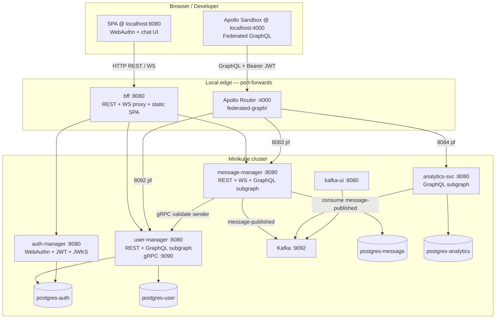
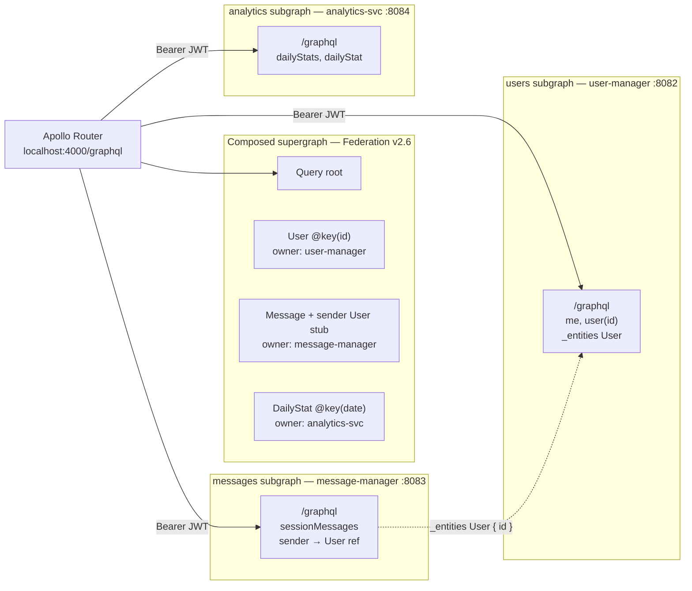
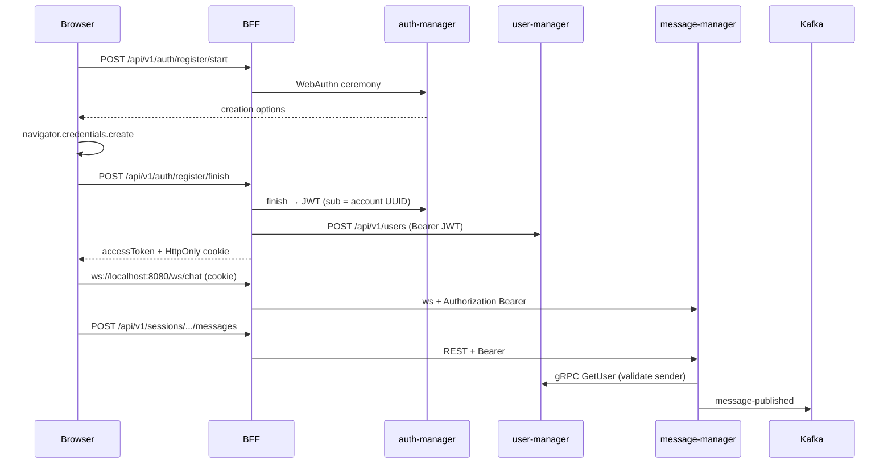
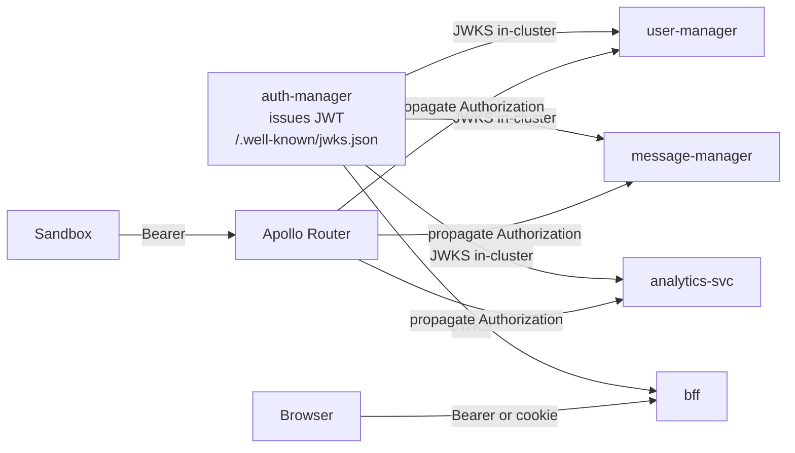
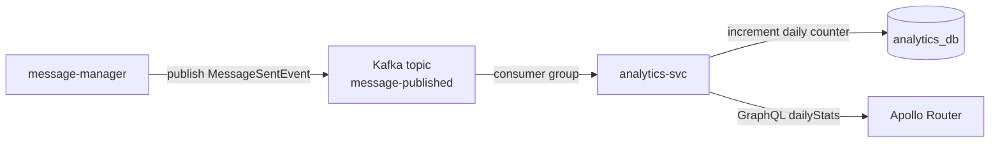

# Distributed chat — architecture

Single path for registration, auth, profiles, messages, and analytics. REST + WebSocket via BFF; federated GraphQL via Apollo Router.

## System overview



## Components

| Service | Role | HTTP | Other | Database |
|---------|------|------|-------|----------|
| **bff** | Public REST/WS entry; SPA; JWT validation; orchestrates register | 8080 (pf) | — | None |
| **auth-manager** | WebAuthn + JWT issuer; JWKS | 8081 (pf) / 8080 (in-cluster) | — | auth_db |
| **user-manager** | Profiles; **users** GraphQL subgraph; gRPC `GetUser` | 8082 (pf) / 8080 | gRPC 9090 | user_db |
| **message-manager** | Chat REST/WS; **messages** GraphQL subgraph; Kafka producer | 8083 (pf) / 8080 | — | message_db |
| **analytics-svc** | Daily message stats; **analytics** GraphQL subgraph; Kafka consumer | 8084 (pf) / 8080 | — | analytics_db |
| **Apollo Router** | Composes supergraph; Sandbox UI; forwards `Authorization` | 4000 (host) | health 8088 | None |

Auth and User are **independent** (no gRPC between them). BFF links them after registration.

## Federated GraphQL layer



**Subgraph ownership**

| GraphQL | Subgraph | Key operations |
|---------|----------|----------------|
| `User` (full) | user-manager | `me`, `user(id)` — own id only; `@DgsEntityFetcher` for federation |
| `User` (stub) | message-manager | `id` only on `Message.sender` |
| `Message` | message-manager | `sessionMessages(sessionId)` — participant check via JWT |
| `DailyStat` | analytics-svc | `dailyStats`, `dailyStat(date)` |

**Auth on the graph:** Every subgraph is an OAuth2 resource server (`jwk-set-uri` → auth-manager JWKS). Router propagates `Authorization: Bearer` to all subgraphs. Sandbox headers must include the same JWT as REST.

**Local dev wiring**

```text
Terminal 1:  kubectl port-forward svc/bff 8080:8080
Terminal 2:  ./federated-graph/scripts/port-forward-subgraphs.sh   # 8081–8084
Terminal 3:  cd federated-graph && ./scripts/run-router.sh         # :4000 Sandbox
```

Compose supergraph after schema changes: `./federated-graph/scripts/compose-supergraph.sh`

## REST + WebSocket path (chat SPA)



## JWT validation



## Kafka + analytics



## Registration flow (auth first)

1. Client → **BFF** `POST /api/v1/auth/register/start` `{ userName, email }`
2. BFF → **auth-manager** → WebAuthn ceremony → `ceremonyId` + options
3. Browser runs WebAuthn (`navigator.credentials.create`)
4. Client → **BFF** `POST /api/v1/auth/register/finish`
5. BFF → **auth-manager** finish → JWT (`sub` = account UUID)
6. BFF → **user-manager** `POST /api/v1/users` with `id` = JWT `sub`

## Login flow

1. `POST /api/v1/auth/login/start` `{ userName }`
2. WebAuthn assert in browser
3. `POST /api/v1/auth/login/finish` → JWT + cookie

## Messages

- **REST (via BFF, JWT):** `POST/GET /api/v1/sessions/{sessionId}/messages`
- **GraphQL (via Router, JWT):** `sessionMessages(sessionId)` on message subgraph
- **message-manager** validates sender via **gRPC → user-manager**, publishes **`message-published`**
- **WebSocket:** BFF `ws://<bff>/ws/chat` → message-manager `/chat`

## Client rules

| Path | Entry | Auth |
|------|-------|------|
| Chat SPA | `http://localhost:8080` | Cookie + Bearer on REST |
| Federated GraphQL | `http://localhost:4000` (Sandbox) | `Authorization: Bearer` in connection headers |
| Subgraph GraphiQL | `:8082` / `:8083` / `:8084` /graphql | Bearer JWT |

`userId` everywhere = UUID from JWT `sub` (auth account id = user profile id).

## Local ports

| Service | Host port-forward | In-cluster |
|---------|-------------------|------------|
| bff | 8080 | 8080 |
| auth-manager | 8081 | 8080 |
| user-manager HTTP | 8082 | 8080 |
| user-manager gRPC | — | 9090 |
| message-manager | 8083 | 8080 |
| analytics-svc | 8084 | 8080 |
| Apollo Router + Sandbox | 4000 | — (runs on host) |
| kafka-ui | 8089 | 8080 |

BFF env (when ports differ): `APP_AUTH_MANAGER_URL`, `APP_USER_MANAGER_URL`, `APP_MESSAGE_MANAGER_URL`, `APP_JWK_SET_URI`.

## WebSocket authentication

Browsers cannot set `Authorization` on `new WebSocket()`:

1. Login/register sets **HttpOnly** cookie `chat_access_token` + JSON `accessToken`
2. Browser opens `ws://<bff>/ws/chat` (cookie sent on upgrade)
3. BFF validates JWT from cookie or header
4. BFF proxies to message-manager with `Authorization: Bearer` only

## Security notes (GraphQL)

- **`me`** — always returns caller's profile (JWT `sub`)
- **`user(id)`** — only when `id` matches JWT `sub` (403 otherwise)
- **`sessionMessages`** — only messages for sessions the caller participates in
- **Federation `_entities` for `User`** — resolves sender display names for messages in allowed sessions

## Repo layout (relevant)

```text
bff/                    REST + WS + SPA
auth-manager/           WebAuthn, JWT, JWKS
user-manager/           profiles, gRPC, users subgraph
message-manager/        chat, Kafka producer, messages subgraph
analytics-svc/          stats, Kafka consumer, analytics subgraph
federated-graph/        supergraph.yaml, router.yaml, Apollo Router scripts
k8s/minikube/all.yaml   Postgres ×3, Kafka, core services
scripts/                deploy-minikube.sh, run-all-ms-dev.sh
```
